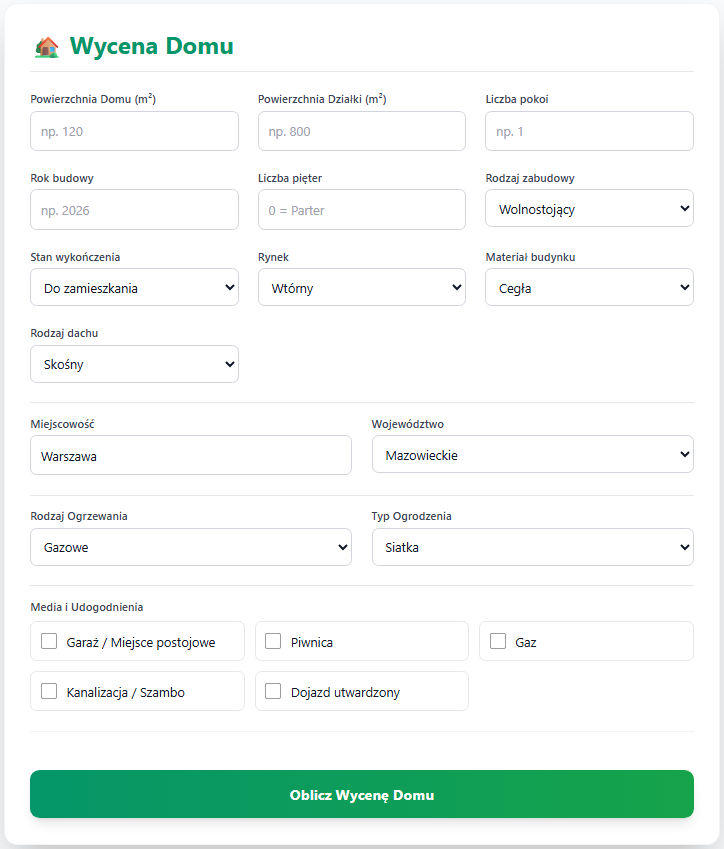
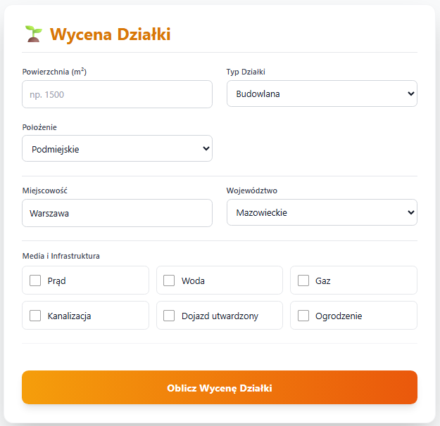
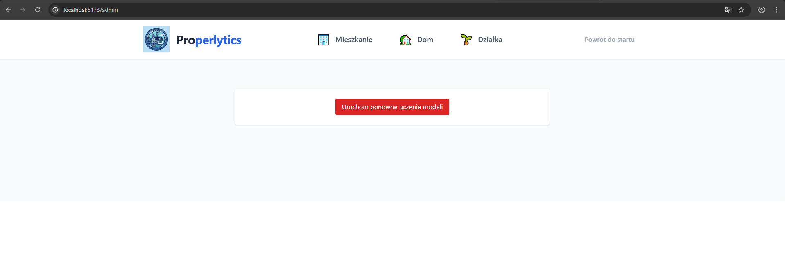

# Properlytics - Inteligentna Wycena Nieruchomości z XAI

Properlytics to aplikacja webowa typu SPA (Single Page Application) służąca do estymacji cen nieruchomości oraz wyjaśniania wpływu poszczególnych cech na wycenę przy użyciu Explainable AI (XAI).

## 📋 O Projekcie

Rynek nieruchomości charakteryzuje się dużą dynamiką, a standardowe wyceny oparte na średniej cenie za m² często są niedokładne.
Celem tego projektu jest dostarczenie rzetelnej wyceny dla trzech typów nieruchomości:
* 🏠 **Domów**
* 🏢 **Mieszkań**
* 🌱 **Działek**

Kluczową innowacją systemu jest moduł **Interpretowalności (XAI)**. Aplikacja nie tylko podaje szacowaną kwotę, ale również wyjaśnia, dlaczego cena jest taka, a nie inna (np. jak rok budowy lub lokalizacja wpłynęły na wynik).

## 🚀 Funkcjonalności

* **Dedykowane formularze:** Osobne zestawy atrybutów dla domów (np. rodzaj dachu), mieszkań (np. piętro, winda) i działek (np. media, dojazd).
* **Explainable AI (SHAP):** Interaktywne wykresy pokazujące pozytywny (zielony) i negatywny (czerwony) wpływ cech na cenę względem średniej rynkowej.
* **Predykcja w czasie rzeczywistym:** Szybka komunikacja z modelem Machine Learning poprzez API.
* **Walidacja danych:** Wielopoziomowa walidacja formularzy (Frontend + Pydantic na Backendzie).
* **Panel Administratora:** Możliwość ręcznego przetrenowania modeli (retraining) na żądanie, co pozwala na aktualizację wycen w oparciu o nowe dane rynkowe.

## 🛠️ Stos Technologiczny

Projekt zrealizowano w architekturze klient-serwer.

### Frontend (Warstwa Klienta)
* **React.js + Vite:** Szybkie renderowanie i responsywność.
* **TypeScript:** Statyczne typowanie dla bezpieczeństwa kodu.
* **Tailwind CSS:** Responsywny interfejs (RWD).
* **Recharts:** Generowanie wykresów XAI.
* **Axios:** Komunikacja z API.

### Backend i Machine Learning
* **Python & FastAPI:** Asynchroniczne, wydajne API REST.
* **Scikit-learn:** Model Lasu Losowego (RandomForestRegressor).
* **SHAP:** Biblioteka do interpretacji predykcji modelu ("czarnej skrzynki").
* **Pandas / NumPy:** Przetwarzanie i czyszczenie danych.

### Dane
Dane treningowe zostały pozyskane przy użyciu skraperów z portalu Otodom.

## ⚙️ Instalacja i Uruchomienie

Projekt jest skonteneryzowany. Aby go uruchomić, potrzebujesz zainstalowanego i uruchomionego Dockera.

W folderze głównym projektu wykonaj komendę:

```bash
docker compose up --build
```

### 🌍 Dostęp do aplikacji

Aplikacja będzie dostępna pod adresami:

*  http://localhost:5173
*  http://localhost:5173/admin
*  http://localhost:8000/docs

## 📸 Zrzuty ekranu

### Strona główna


### Formularz wyceny mieszkania


### Formularz wyceny domu


### Formularz wyceny działki


### Przycisk ponownego uczenia modeli w panelu admina


## 👥 Zespół Realizujący

Projekt został zrealizowany przez:

* Filip Ślemp
* Jakub Róg
* Kacper Papiernik
* Olaf Słowik
